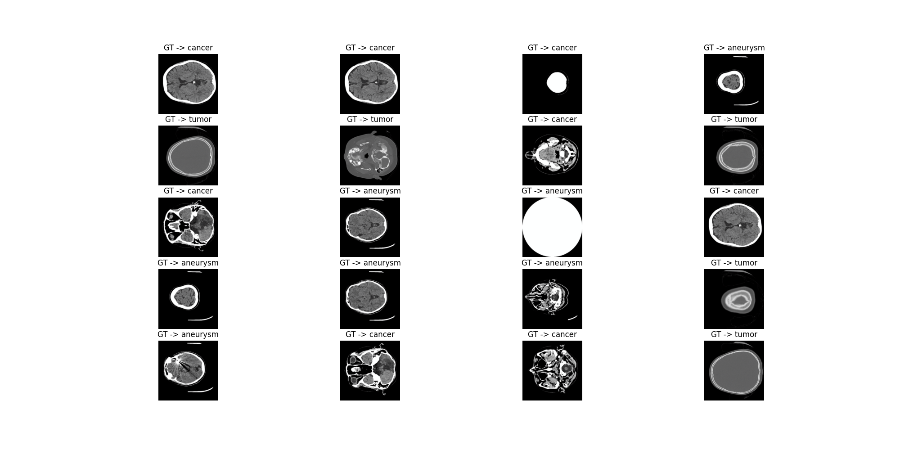
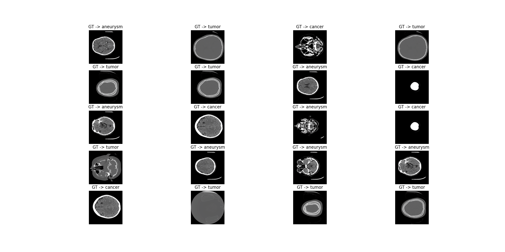
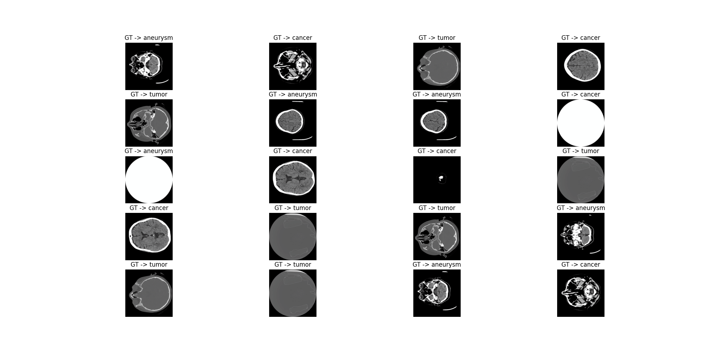
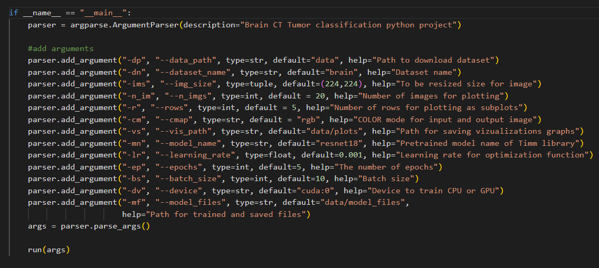
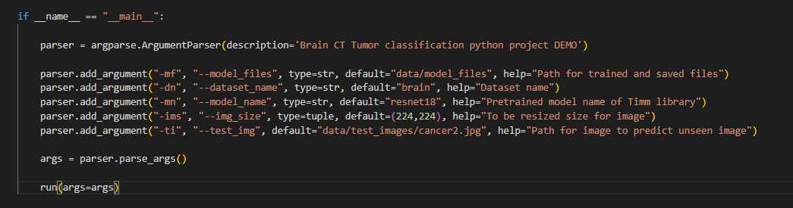

# Brain CT Image Classification

## Project Overview
This project develops a machine learning model to classify brain CT images into three conditions: aneurysm, tumor, and cancer. Built with PyTorch and Timm, the model leverages transfer learning for high accuracy, and Streamlit is used to create an interactive web demo.

## Installation

To set up the project environment:
#### 1-method

```bash
git clone https://github.com/cengineer13/brain-ct-classification.git
cd brain-ct-classification
pip install -r requirements.txt
```

#### 2-method

Create conda environment using two methods:

a) Create a virtual environment using yml file:

```python
conda env create -f environment.yml
```

Then activate the environment using the following command:
```python
conda activate ds
```

b) Create a virtual environment using txt file:

- Create a virtual environment:

```python
conda create -n ds python=3.10
```

- Activate the environment using the following command:

```python
conda activate ds
```

- Install libraries from the text file:

```python
pip install -r requirements.txt
```

## Dataset

The dataset contains 259 brain CT images classified into aneurysm, tumor, and cancer classes.
* Download dataset from the [link](https://www.kaggle.com/datasets/killa92/brain-ct-tumor-classification-dataset).

<h4 align="center"> Training dataset examples</h4>



<h4 align="center"> Validation dataset examples</h4>



<h4 align="center"> Test dataset examples</h4>



These images are random visualizations from the training, validation, and test sets.

## Model Performance

The model's training and validation metrics are visualized below:


### Accuracy Graph Analysis:
Training Accuracy quickly rises to nearly 100% by the second epoch, indicating that the model fits the training data very well.
Validation Accuracy starts high around 95% and remains relatively stable, slightly increasing and then plateauing. This shows good generalization but also suggests possible overfitting as it doesn’t reach the training accuracy.
### Loss Graph Analysis:
Training Loss drops sharply initially, from around 0.65 to near 0.05 by the second epoch, showing that the model quickly reduces error on the training data.
Validation Loss decreases more gradually, leveling off around the same low value as the training loss by the fifth epoch, which suggests that the model’s predictions on the validation set are becoming stable.
### Summary:
The model learns effectively, as shown by rapid improvements in training metrics. However, the gap between training and validation accuracy suggests some overfitting. Both loss curves converging at a low value by the end indicate good model stability and generalization at the end of training. Further measures might be considered to narrow the gap between training and validation accuracy to ensure the model generalizes well to new data.
The curves represent the model's accuracy and loss over epochs, indicating the learning process and convergence.

## Inference

Here's how the model performs on the test set:


Each row shows the ground truth and predicted label for brain CT images.

## GradCAM Visualizations

The model's attention is visualized using GradCAM, which helps understand which regions of the images influenced the predictions:


Each image highlights the areas most influential for the model's predictions.

### Arguments for training 
* Train the model using the following arguments:



```python

python main.py  --batch_size 32 --epochs 15

```
* Inference demo process with trained model using the following arguments:



```python

python demo.py--model_name "brain"  --test_img "path_to_test_image" 

```


## Testing on New Data &  Interactive Web Demo

A Streamlit web app (`demo.py`) allows users to upload an image and receive model predictions in a user-friendly interface.

```bash
streamlit run demo.py
```
Result: 


To evaluate the model on new, I used this unseen images:


These are examples of new data images passed through the model.


## Contributing

We welcome contributions from the community. Please read the contributing guidelines first before making a pull request.

## License

This project is licensed under the MIT License - see [LICENSE.md](LICENSE.md) for details.

## Contact

Mr Murodil  - murodild@gmail.com
LinkedIn - https://www.linkedin.com/in/mr-murodil
Project Link: [https://github.com/yourusername/brain-ct-classification](https://github.com/cengineer13/brain-ct-classification)
